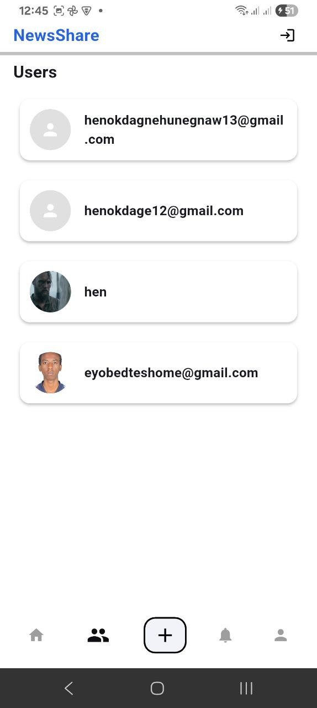
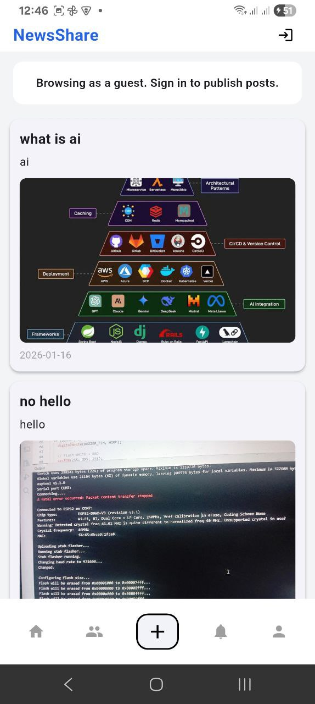
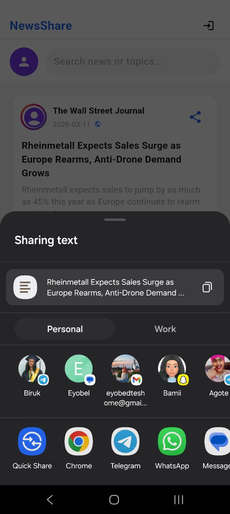

# NewsShare

<p align="center">
  
</p>

<p align="center">
  
  
</p>

A modern Flutter social-news application that combines real-time content discovery with community interaction.

NewsShare lets users browse headlines, search topics, create posts, discover other users, and share content across apps. The app also supports guest read-only browsing for key pages.

## Highlights

- Public read-only browsing for Home, Users, and Post feed
- Email/password and Google authentication
- Personalized profile with avatar support
- Create and publish posts with optional image upload
- Follow and unfollow users
- Notification screen for account activity
- In-app and system share actions for news items
- Supabase-powered backend for auth, database, and storage

## Feature Overview

- Home Feed
  - Live news feed with search and pull-to-refresh
  - Share-ready news cards
- Users
  - Discover people in the app
  - Follow actions available for authenticated users
- Posts
  - Public post list for all visitors
  - Create/edit/delete actions for signed-in users
- Profile
  - Profile view and editing for signed-in users
  - Guest-safe profile state when not authenticated
- Notifications
  - Private per-user notifications
  - Sign-in prompt for guests

## Screenshots

<table>
  <tr>
    <td align="center"><strong>Home</strong></td>
    <td align="center"><strong>Users</strong></td>
  </tr>
  <tr>
    <td></td>
    <td></td>
  </tr>
  <tr>
    <td align="center"><strong>Posts</strong></td>
    <td align="center"><strong>Share Flow</strong></td>
  </tr>
  <tr>
    <td></td>
    <td></td>
  </tr>
</table>

## Tech Stack

- Flutter (Dart)
- Supabase
  - Authentication
  - Postgres database
  - Storage
- Firebase Core and Firebase Auth (integrated dependencies)
- Google Sign-In
- HTTP + News API
- Share Plus

## Project Structure

- lib
  - screens: app UI flows
  - services: API and backend integrations
  - models: app data models
- assets
  - images: logos and UI screenshots
  - json: local/fallback data files
- supabase
  - functions: edge functions
  - migrations: SQL policies and schema updates

## Getting Started

### 1) Prerequisites

- Flutter SDK (stable)
- Dart SDK (included with Flutter)
- Android Studio or VS Code
- A Supabase project

### 2) Clone and install

```bash
git clone <your-repo-url>
cd news_share
flutter pub get
```

### 3) Configure environment

Create a .env file in the project root and add required values:

```env
NEXT_PUBLIC_SUPABASE_URL=your_supabase_project_url
NEXT_PUBLIC_SUPABASE_PUBLISHABLE_DEFAULT_KEY=your_supabase_anon_key
NEWS_API_KEY=your_news_api_key
```

### 4) Run the app

```bash
flutter run
```

## Supabase Notes

To support guest read-only pages, ensure your Supabase RLS policies allow anon SELECT on the public tables you want visible (for example, profiles and posts).

Keep private data and write operations restricted to authenticated users (for example, notifications, follow actions, and post creation).

## Security

- Never commit real secrets to source control.
- Use environment variables for API keys and project credentials.
- Rotate any leaked or previously exposed credentials.

## Roadmap

- Improve feed personalization
- Add post comments and reactions
- Push notification enhancements
- Better moderation and admin tooling

## License

This project is currently private and has no declared open-source license.
